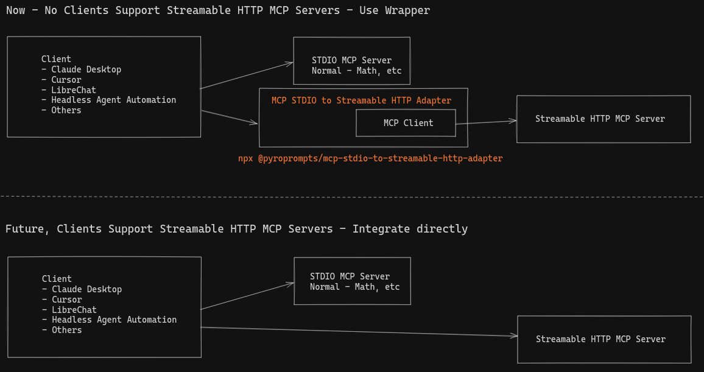

# mcp-stdio-to-streamable-http-adapter MCP Server

Integrate any MCP Client that has STDIO MCP Server Support (most do) with the Streamable HTTP MCP Servers

_Note_: This has similarities to the [mcp-remote package](https://www.npmjs.com/package/mcp-remote)

## Why?

The [MCP Spec to add a Streamable HTTP Transport landed end of March 2025](https://modelcontextprotocol.io/specification/2025-03-26) and as of the end of April, no clients have adopted support. The typescript-sdk has merged the code, but not released. The Python SDK is still in development to support it. The Inspector supports it, but that's it.

This leaves developers in an awkward position. Develop the MCP Server using STDIO or SSE (deprecated) so it works with clients or develop with Streamable HTTP transport, but nobody can use it.

I ([ferrants](https://heyferrante.com)) want to start integrating the Streamable HTTP MCP Servers beyond just the inspector, so I need a way to connect them to clients and LLMs right away!

This package aims to bridge the cap by being a STDIO MCP Server that relays to your Streamable HTTP MCP Server. This makes all MCP Clients support Streamable HTTP right away. And now developers can develop the Streamable HTTP MCP Servers and provide an installation method.





## Installation

To add OpenAI to Claude Desktop, add the server config:

On MacOS: `~/Library/Application Support/Claude/claude_desktop_config.json`

On Windows: `%APPDATA%/Claude/claude_desktop_config.json`

### Env Vars

- `URI`: The URL of the Streamable HTTP MCP Server. This is required.
- `MCP_NAME`: The name of the MCP Server. This is optional. If you configure multiple, this is required so they do not have the same names.
- `BEARER_TOKEN`: The Bearer token for the Streamable HTTP MCP Server. This is optional. If specified, this will be sent along in the Authorization header.


### Configuration

You can use it via `npx` in your Claude Desktop configuration like this:

```json
{
  "mcpServers": {
    "my-saas-app-development": {
      "command": "npx",
      "args": [
        "@pyroprompts/mcp-stdio-to-streamable-http-adapter"
      ],
      "env": {
        "URI": "http://localhost:3002/mcp",
        "MCP_NAME": "local-custom-streamable-http-adapter"
      }
    }
  }
}
```


Or, if you clone the repo, you can build and use in your Claude Desktop configuration like this:


```json

{
  "mcpServers": {
    "my-saas-app-development": {
      "command": "node",
      "args": [
        "/path/to/mcp-stdio-to-streamable-http-adapter/build/index.js"
      ],
      "env": {
        "URI": "http://localhost:3002/mcp",
        "MCP_NAME": "local-custom-streamable-http-adapter"
      }
    }
  }
}
```

You can add multiple providers by referencing the same MCP server multiple times, but with different env arguments:

```json

{
  "mcpServers": {
    "my-saas-app-development": {
      "command": "node",
      "args": [
        "/path/to/mcp-stdio-to-streamable-http-adapter/build/index.js"
      ],
      "env": {
        "URI": "http://localhost:3002/mcp",
        "MCP_NAME": "local-custom-streamable-http-adapter"
      }
    },
    "pyroprompts": {
      "command": "node",
      "args": [
        "/path/to/mcp-stdio-to-streamable-http-adapter/build/index.js"
      ],
      "env": {
        "URI": "https://api.pyroprompts.com/mcp",
        "MCP_NAME": "pyroprompts",
        "BEARER_TOKEN": "abcdefg"
      }
    }
  }
}
```

With these three, you'll see a tool for each in the Claude Desktop Home:


And then you can chat with other LLMs and it shows in chat like this:


Or, configure in [LibreChat](https://www.librechat.ai/) like:
```yaml
  my-saas-app-development:
    type: stdio
    command: npx
    args:
      - -y
      - @pyroprompts/mcp-stdio-to-streamable-http-adapter
    env:
      URI: "http://localhost:3002/mcp",
      MCP_NAME: "my-custom-saas-app"
      PATH: '/usr/local/bin:/usr/bin:/bin'
````

And it shows in LibreChat:


## Development

Install dependencies:
```bash
npm install
```

Build the server:
```bash
npm run build
```

For development with auto-rebuild:
```bash
npm run watch
```

### Debugging

Since MCP servers communicate over stdio, debugging can be challenging. We recommend using the [MCP Inspector](https://github.com/modelcontextprotocol/inspector), which is available as a package script:

```bash
npm run inspector
```

The Inspector will provide a URL to access debugging tools in your browser.

### Acknowledgements

- Obviously the modelcontextprotocol and Anthropic teams for the MCP Specification and integration into Claude Desktop. [https://modelcontextprotocol.io/introduction](https://modelcontextprotocol.io/introduction)
- [PyroPrompts](https://pyroprompts.com?ref=github-mcp-stdio-to-streamable-http-adapter) for sponsoring this project. Use code `MCPSTREAMABLEADAPTER` for 20 free automation credits on Pyroprompts.
